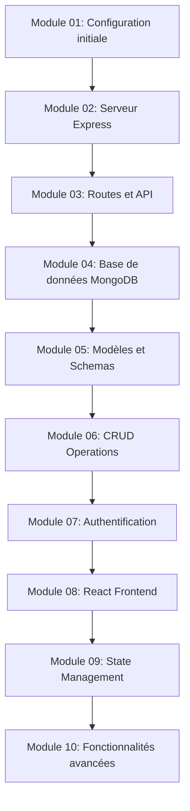

# 📚 Documentation pédagogique - MERN JS Project

Bienvenue dans la documentation pédagogique de ce projet. Cette série de modules vous guidera pas à pas dans le développement d'une application MERN complète.

## 🎯 Objectif général

Ce cours progressif vous permettra de maîtriser la stack MERN (MongoDB, Express, React, Node.js) en construisant une application complète, étape par étape.

---

## 📋 Liste des modules

| Module | Titre | Tag Git | Statut |
|--------|-------|---------|--------|
| [Module 00](module-00-template.md) | Template de référence | - | ✅ Template |
| [Module 01](module-01.md) | Configuration initiale du projet | `module-01` | ✅ Terminé |
| [Module 02](module-02.md) | Docker et MongoDB | `module-02` | ✅ Terminé |
| [Module 03](module-03.md) | Connexion MongoDB avec Mongoose | `module-03` | ✅ Terminé |
| [Module 04](module-04.md) | Modèle Article (Schema Mongoose) | `module-04` | ✅ Terminé |
| Module 05 | Routes et Controllers - Articles | `module-05` | ⏳ En attente |
| Module 06 | Opérations CRUD complètes | `module-06` | ⏳ En attente |

> **Note :** Cette liste sera mise à jour au fur et à mesure de l'avancement du projet.

---

## 🗺️ Parcours d'apprentissage



---

## 🚀 Comment utiliser cette documentation

### 1. Suivre l'ordre des modules

Les modules sont conçus pour être suivis dans l'ordre. Chaque module s'appuie sur les connaissances acquises dans les modules précédents.

### 2. Alterner théorie et pratique

Chaque module contient :
- **30-40% de théorie** : Comprendre les concepts
- **60-70% de pratique** : Mettre en œuvre concrètement

### 3. Utiliser les tags Git

Chaque module correspond à un tag Git. Vous pouvez :

```bash
# Voir tous les modules disponibles
git tag -l

# Se positionner sur un module spécifique
git checkout module-01

# Revenir à la version la plus récente
git checkout main
```

### 4. Valider vos acquis

À la fin de chaque module, utilisez la checklist de validation pour vous assurer d'avoir bien compris avant de passer au suivant.

---

## 📖 Structure d'un module

Chaque module suit la même structure :

1. **Objectifs d'apprentissage** : Ce que vous allez apprendre
2. **Prérequis** : Ce qu'il faut savoir avant de commencer
3. **Partie théorique** : Concepts et explications
4. **Schémas et visualisations** : Représentations visuelles
5. **Partie pratique** : Code et implémentation
6. **Points clés** : Résumé et checklist
7. **Exercices** : Pour aller plus loin
8. **Référence Git** : Commits et tags associés

---

## 🛠️ Prérequis généraux

Avant de commencer ce cours, vous devriez avoir :

- **Connaissances de base en JavaScript** (ES6+)
- **Notion de HTML/CSS**
- **Node.js installé** (version 14+)
- **Git installé** et configuré
- **Un éditeur de code** (VS Code recommandé)
- **Une base de données MongoDB** (locale ou cloud)

### Installation de l'environnement

```bash
# Vérifier Node.js
node --version

# Vérifier npm
npm --version

# Vérifier Git
git --version
```

---

## 📚 Ressources complémentaires

### Documentation officielle

- [Node.js](https://nodejs.org/en/docs/)
- [Express](https://expressjs.com/)
- [React](https://react.dev/)
- [MongoDB](https://docs.mongodb.com/)

### Outils recommandés

- [Postman](https://www.postman.com/) : Tester les APIs
- [MongoDB Compass](https://www.mongodb.com/products/compass) : Interface graphique pour MongoDB
- [React DevTools](https://react.dev/learn/react-developer-tools) : Debugger React

---

## 🤝 Contribution

Ce projet est pédagogique et ouvert aux contributions. Si vous souhaitez :

- Améliorer la documentation
- Corriger une erreur
- Proposer un nouveau module
- Ajouter des exercices

N'hésitez pas à ouvrir une issue ou une pull request !

---

## 📞 Support

Si vous rencontrez des difficultés :

1. Relisez attentivement le module concerné
2. Vérifiez que vous avez bien suivi toutes les étapes
3. Consultez la section "Problèmes courants" du module
4. Vérifiez votre code avec le tag Git correspondant

---

## 📝 Progression

### Niveau Débutant
- [ ] Modules 01-03 : Bases du backend

### Niveau Intermédiaire
- [ ] Modules 04-07 : Backend avancé et authentification

### Niveau Avancé
- [ ] Modules 08-10 : Frontend et intégration complète

---

**Bon apprentissage ! 🚀**

---

*Dernière mise à jour : [À remplir]*  
*Version : 1.0.0*

