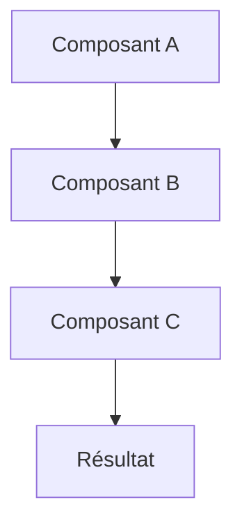
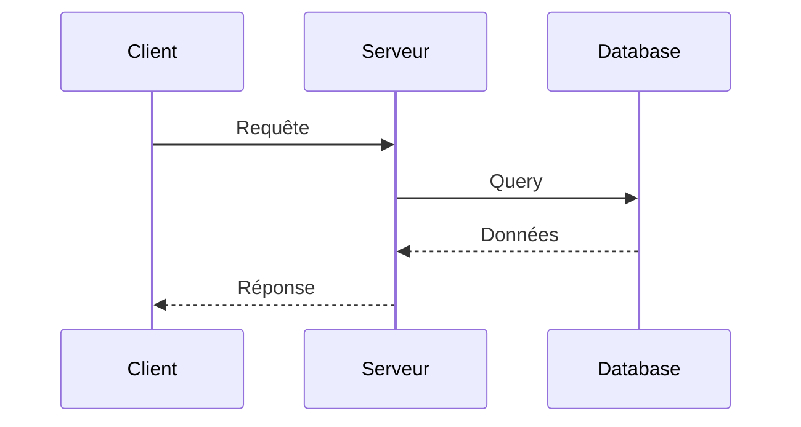

# Module XX : [Titre du Module]

> **Tag Git** : `module-XX` ou `module-XX-nom-descriptif`  
> **Commit(s)** : `[MODULE-XX] Description de la fonctionnalité`

---

## 🎯 Objectifs d'apprentissage

À la fin de ce module, vous serez capable de :

- [ ] Objectif 1 : Description claire et mesurable
- [ ] Objectif 2 : Compétence acquise
- [ ] Objectif 3 : Savoir-faire pratique

## 📚 Prérequis

- Prérequis 1 (ex: Connaissance de JavaScript ES6)
- Prérequis 2 (ex: Module précédent complété)
- Prérequis 3 (ex: Node.js installé)

---

## 📖 Partie théorique (30-40%)

### Introduction

Explication générale du concept abordé dans ce module. Pourquoi est-ce important ? Dans quel contexte utilise-t-on cette technologie/approche ?

### Concepts clés

#### Concept 1 : [Nom du concept]

Explication détaillée et accessible du premier concept.

**Vocabulaire technique :**
- **Terme 1** : Définition claire
- **Terme 2** : Définition claire
- **Terme 3** : Définition claire

#### Concept 2 : [Nom du concept]

Explication du deuxième concept avec exemples simples.

### Pourquoi cette approche ?

Justification pédagogique et technique de la solution choisie. Avantages et cas d'usage.

---

## 📊 Schémas et visualisations

### Architecture générale



### Flux de données



### Schéma conceptuel

Ajouter d'autres schémas si nécessaire (architecture, diagrammes de classes, etc.)

---

## 💻 Partie pratique (60-70%)

### Étape 1 : [Première étape]

Description de ce qu'on va faire et pourquoi.

**Code à implémenter :**

```javascript
// Commentaire explicatif pour les apprenants
// Pourquoi on fait cette étape, qu'est-ce qu'elle apporte

const exemple = "Code commenté";

// Explication ligne par ligne si nécessaire
function demonstrationConcept() {
    // Logique expliquée
    return "résultat";
}
```

**Explication détaillée :**
1. Première sous-étape expliquée
2. Deuxième sous-étape expliquée
3. Résultat attendu

### Étape 2 : [Deuxième étape]

Description et justification.

**Code :**

```javascript
// Suite de l'implémentation
// Commentaires pédagogiques

class ExempleClasse {
    constructor() {
        // Initialisation expliquée
    }
    
    methode() {
        // Fonctionnalité détaillée
    }
}
```

**Points d'attention :**
- ⚠️ Point important à ne pas manquer
- 💡 Astuce ou bonne pratique
- 🔍 Détail technique à comprendre

### Étape 3 : [Test et validation]

Comment tester que ça fonctionne correctement.

**Commandes à exécuter :**

```bash
# Lancer le serveur
npm start

# Ou tester avec
npm test
```

**Résultat attendu :**

```
Output attendu ou comportement à observer
```

---

## 🎯 Points clés à retenir

### Résumé des concepts importants

1. **Concept principal 1** : Résumé en une phrase
2. **Concept principal 2** : Résumé en une phrase
3. **Concept principal 3** : Résumé en une phrase

## 📝 Référence Git

### Commit(s) associé(s)

```bash
# Commit principal
git log --oneline --grep="MODULE-XX"

# Voir les changements
git show module-XX
```

### Récupérer ce module

```bash
# Checkout vers ce module spécifique
git checkout module-XX

# Ou créer une branche depuis ce tag
git checkout -b ma-branche module-XX
```

### Fichiers modifiés dans ce module

- `src/fichier1.js` : Description des changements
- `src/fichier2.js` : Description des changements
- `package.json` : Dépendances ajoutées

---

## ➡️ Prochaine étape

Dans le **Module XX+1**, nous allons aborder : [Titre du prochain module]

**Transition :** Explication de comment ce module mène naturellement au suivant.

---

## 📌 Notes et remarques

### Notes de développement

- Note technique importante
- Décision d'architecture expliquée
- Alternative envisagée et pourquoi elle n'a pas été retenue

### Problèmes courants et solutions

**Problème 1 :** Description de l'erreur courante

**Solution :** Comment résoudre le problème

---

**Dernière mise à jour :** [Date]  
**Auteur :** [Nom]

