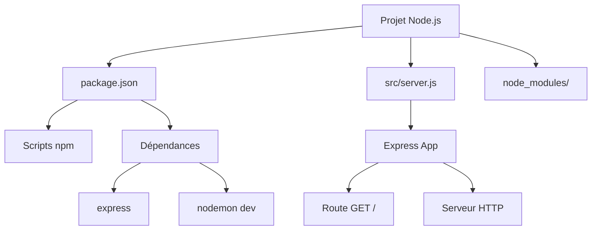
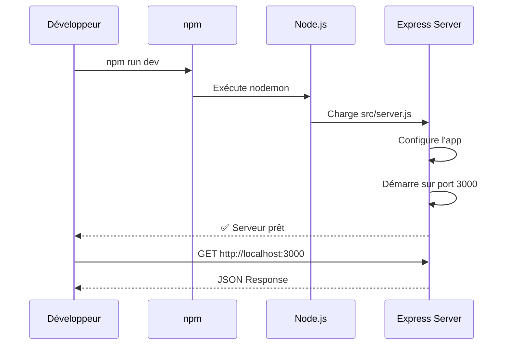

# Module 01 : Configuration initiale du projet

> **Tag Git** : `module-01`  
> **Commit** : `[MODULE-01] Configuration initiale du projet Node.js et serveur Express`

---

## 🎯 Objectifs d'apprentissage

À la fin de ce module, vous serez capable de :

- [ ] Initialiser un projet Node.js avec npm
- [ ] Comprendre la structure de base d'un projet backend
- [ ] Créer un serveur Express minimal
- [ ] Utiliser nodemon pour le développement

## 📚 Prérequis

- Node.js installé (version 14 ou supérieure)
- npm installé (fourni avec Node.js)
- Connaissance de base de JavaScript ES6
- Un éditeur de code (VS Code recommandé)

---

## 📖 Partie théorique (30-40%)

### Introduction

Dans ce premier module, nous allons poser les fondations de notre projet de blog. Avant de pouvoir travailler avec une base de données, il est essentiel de mettre en place correctement notre environnement de développement et notre serveur web.

**Pourquoi est-ce important ?**
- Une bonne structure de projet facilite la maintenance et l'évolution du code
- Les outils de développement (comme nodemon) accélèrent le workflow
- Un serveur Express bien configuré est la base de toute API REST

### Concepts clés

#### Concept 1 : Node.js et npm

**Node.js** est un environnement d'exécution JavaScript côté serveur. Il permet d'utiliser JavaScript en dehors du navigateur.

**npm (Node Package Manager)** est le gestionnaire de paquets de Node.js. Il permet :
- D'installer des bibliothèques externes (dépendances)
- De gérer les versions des dépendances
- De définir des scripts personnalisés

**Vocabulaire technique :**
- **package.json** : Fichier de configuration qui décrit le projet et ses dépendances
- **node_modules** : Dossier contenant toutes les bibliothèques installées
- **scripts npm** : Commandes personnalisées définies dans package.json

#### Concept 2 : Express.js

**Express** est un framework web minimaliste pour Node.js. Il simplifie la création de serveurs HTTP et d'APIs REST.

**Avantages d'Express :**
- Syntaxe simple et intuitive
- Système de routing puissant
- Middleware pour étendre les fonctionnalités
- Grande communauté et documentation riche

#### Concept 3 : Nodemon

**Nodemon** est un outil de développement qui redémarre automatiquement le serveur lorsque des fichiers sont modifiés.

**Pourquoi l'utiliser ?**
- Gain de temps : pas besoin de redémarrer manuellement
- Feedback immédiat lors des modifications
- Améliore la productivité en développement

### Pourquoi cette approche ?

Nous commençons par un serveur **minimal** pour plusieurs raisons pédagogiques :
1. **Validation immédiate** : Vous voyez rapidement que tout fonctionne
2. **Complexité progressive** : Un concept à la fois
3. **Fondation solide** : Structure de projet qui évoluera proprement

---

## 📊 Schémas et visualisations

### Architecture du Module 01



### Flux de démarrage du serveur



---

## 💻 Partie pratique (60-70%)

### Étape 1 : Initialisation du projet Node.js

Nous allons créer le fichier `package.json` qui décrit notre projet.

**Fichier : `package.json`**

```json
{
  "name": "blog-mern-pedagogique",
  "version": "1.0.0",
  "description": "Projet pédagogique pour apprendre la stack MERN et l'exploitation de bases de données",
  "main": "src/server.js",
  "scripts": {
    "start": "node src/server.js",
    "dev": "nodemon src/server.js"
  },
  "keywords": [
    "MERN",
    "MongoDB",
    "Express",
    "React",
    "Node.js",
    "pedagogique",
    "blog"
  ],
  "author": "",
  "license": "ISC",
  "dependencies": {
    "express": "^4.18.2"
  },
  "devDependencies": {
    "nodemon": "^3.0.1"
  }
}
```

**Explication détaillée :**
1. **name** : Identifiant unique du projet (en minuscules, sans espaces)
2. **main** : Point d'entrée de l'application
3. **scripts** : 
   - `start` : Lance le serveur en production
   - `dev` : Lance le serveur en mode développement avec nodemon
4. **dependencies** : Bibliothèques nécessaires en production
5. **devDependencies** : Outils uniquement pour le développement

### Étape 2 : Installation des dépendances

**Commandes à exécuter :**

```bash
# Installer toutes les dépendances définies dans package.json
npm install
```

**Ce qui se passe :**
- npm télécharge express et nodemon
- Un dossier `node_modules/` est créé avec toutes les bibliothèques
- Un fichier `package-lock.json` est généré pour verrouiller les versions

⚠️ **Important** : Le dossier `node_modules/` ne doit JAMAIS être versionné avec Git (d'où le `.gitignore`)

### Étape 3 : Structure des dossiers

Créons la structure de notre projet :

```
MERN_JS_PROJECT/
├── docs/               # Documentation pédagogique
│   └── module-01.md   # Ce fichier
├── src/               # Code source
│   └── server.js      # Serveur Express
├── .gitignore         # Fichiers à ignorer par Git
├── package.json       # Configuration du projet
└── README.md          # Documentation principale
```

### Étape 4 : Création du fichier .gitignore

Le fichier `.gitignore` indique à Git quels fichiers ne pas versionner.

**Fichier : `.gitignore`**

```gitignore
# Dépendances Node.js
node_modules/
package-lock.json

# Variables d'environnement
.env

# Logs
*.log

# Fichiers système
.DS_Store
Thumbs.db
```

**Pourquoi ignorer ces fichiers ?**
- `node_modules/` : Trop volumineux, peut être recréé avec `npm install`
- `.env` : Contient des informations sensibles (mots de passe, clés API)
- Logs et fichiers système : Inutiles pour le versioning

### Étape 5 : Création du serveur Express

**Fichier : `src/server.js`**

```javascript
// Import du module Express
// Express est un framework web minimaliste pour Node.js
const express = require('express');

// Création de l'application Express
// Cette instance sera le coeur de notre serveur web
const app = express();

// Configuration du port
// On utilise la variable d'environnement PORT si elle existe,
// sinon on utilise le port 3000 par défaut
const PORT = process.env.PORT || 3000;

// Route de base pour tester le serveur
// GET / renvoie un message simple pour confirmer que le serveur fonctionne
app.get('/', (req, res) => {
    res.json({
        message: 'Bienvenue sur l\'API du Blog MERN !',
        version: '1.0.0',
        status: 'Le serveur fonctionne correctement'
    });
});

// Démarrage du serveur
// Le serveur écoute sur le port spécifié et affiche un message de confirmation
app.listen(PORT, () => {
    console.log(`🚀 Serveur démarré sur le port ${PORT}`);
    console.log(`📍 URL : http://localhost:${PORT}`);
});
```

**Explication ligne par ligne :**

1. **`require('express')`** : Importe le module Express (syntaxe CommonJS)
2. **`express()`** : Crée une instance de l'application Express
3. **`process.env.PORT || 3000`** : Utilise une variable d'environnement ou 3000 par défaut
4. **`app.get('/', ...)`** : Définit une route qui répond aux requêtes GET sur `/`
5. **`res.json()`** : Envoie une réponse au format JSON
6. **`app.listen()`** : Démarre le serveur sur le port spécifié

**Points d'attention :**
- ⚠️ Le serveur doit être redémarré après chaque modification (pour l'instant)
- 💡 `res.json()` définit automatiquement le header `Content-Type: application/json`
- 🔍 Le callback dans `app.listen()` s'exécute une fois le serveur démarré

### Étape 6 : Test et validation

**Démarrer le serveur :**

```bash
# En mode développement (avec auto-reload)
npm run dev
```

**Résultat attendu dans le terminal :**

```
🚀 Serveur démarré sur le port 3000
📍 URL : http://localhost:3000
```

**Tester dans le navigateur :**

Ouvrez http://localhost:3000 dans votre navigateur ou utilisez curl :

```bash
curl http://localhost:3000
```

**Réponse attendue :**

```json
{
  "message": "Bienvenue sur l'API du Blog MERN !",
  "version": "1.0.0",
  "status": "Le serveur fonctionne correctement"
}
```

✅ Si vous voyez cette réponse, félicitations ! Votre serveur fonctionne.

---

## 🎯 Points clés à retenir

### Résumé des concepts importants

1. **package.json** : Fichier de configuration central qui décrit le projet et gère les dépendances
2. **Express** : Framework web qui simplifie la création de serveurs et d'APIs
3. **Nodemon** : Outil de développement qui redémarre automatiquement le serveur
4. **Structure MVC** : Nous préparons une architecture qui évoluera (src/, docs/, etc.)

### Checklist de validation

Avant de passer au module suivant, assurez-vous que :

- [ ] Le fichier `package.json` est créé et valide
- [ ] Les dépendances sont installées (`node_modules/` existe)
- [ ] Le serveur démarre sans erreur avec `npm run dev`
- [ ] La route GET / renvoie la réponse JSON attendue
- [ ] Vous comprenez le rôle d'Express et de nodemon

### Commandes essentielles à retenir

```bash
# Installer les dépendances
npm install

# Démarrer en mode développement
npm run dev

# Démarrer en mode production
npm start

# Arrêter le serveur
Ctrl + C
```

---

## 📝 Référence Git

### Commit(s) associé(s)

```bash
# Voir le commit de ce module
git log --oneline --grep="MODULE-01"

# Voir les changements
git show module-01
```

### Récupérer ce module

```bash
# Checkout vers ce module spécifique
git checkout module-01

# Revenir à la version actuelle
git checkout main
```

### Fichiers créés dans ce module

- `package.json` : Configuration du projet Node.js
- `src/server.js` : Serveur Express minimal
- `.gitignore` : Fichiers à ignorer par Git
- `docs/module-01.md` : Documentation de ce module

---

## ➡️ Prochaine étape

Dans le **Module 02**, nous allons aborder : **Docker et MongoDB**

**Transition :** Maintenant que nous avons un serveur fonctionnel, nous allons mettre en place MongoDB avec Docker pour pouvoir stocker et gérer nos données de blog.

---

## 📌 Notes et remarques

### Notes de développement

- Nous utilisons CommonJS (`require`) et non ES Modules (`import`) pour rester compatible avec toutes les versions de Node.js
- Le port 3000 est un standard pour le développement, mais peut être changé si nécessaire
- La structure actuelle est minimale mais évolutive

### Problèmes courants et solutions

**Problème 1 :** `Error: Cannot find module 'express'`

**Solution :** Les dépendances ne sont pas installées. Exécutez `npm install`

**Problème 2 :** `Port 3000 is already in use`

**Solution :** Un autre processus utilise le port 3000. Arrêtez-le ou changez le port :
```bash
PORT=3001 npm run dev
```

**Problème 3 :** Les modifications ne sont pas prises en compte

**Solution :** Si vous utilisez `npm start`, le serveur ne redémarre pas automatiquement. Utilisez `npm run dev` avec nodemon.

---

**Dernière mise à jour :** 24 octobre 2025  
**Module :** 01/15

