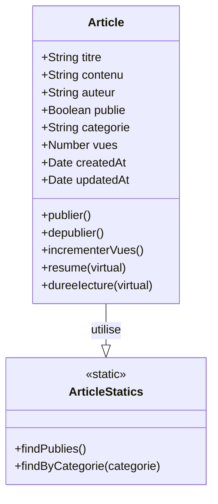
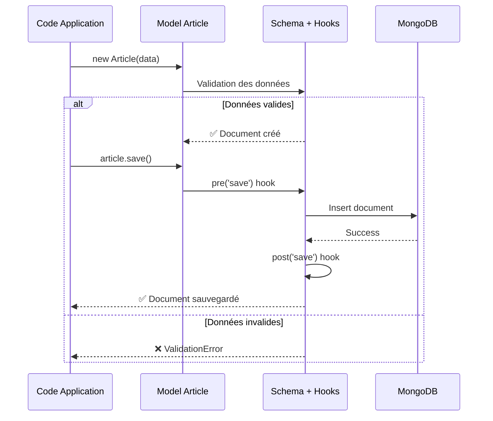
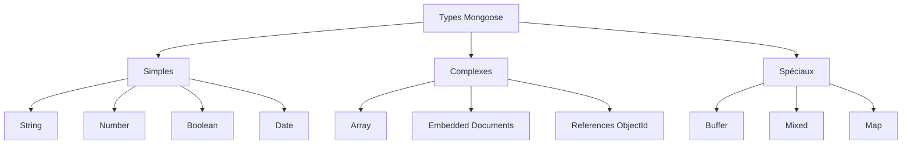

# Module 04 : Modèle Article (Schema Mongoose)

> **Tag Git** : `module-04`  
> **Commit** : `[MODULE-04] Création du modèle Article avec schéma Mongoose`

---

## 🎯 Objectifs d'apprentissage

À la fin de ce module, vous serez capable de :

- [ ] Créer un schéma Mongoose complet
- [ ] Utiliser les validations intégrées de Mongoose
- [ ] Définir des méthodes d'instance et statiques
- [ ] Créer des champs virtuels
- [ ] Utiliser les middleware (hooks) Mongoose
- [ ] Comprendre les timestamps automatiques

## 📚 Prérequis

- Modules 01 à 03 complétés
- Compréhension des objets JavaScript et des classes
- Connaissance de base des promesses et async/await

---

## 📖 Partie théorique (30-40%)

### Introduction

Maintenant que notre application est connectée à MongoDB, nous pouvons créer notre **premier modèle de données** : l'Article. Un modèle définit la structure des documents que nous allons stocker dans la base de données.

**Qu'est-ce qu'un modèle Mongoose ?**
Un modèle est une classe créée à partir d'un schéma. Il permet de :
- Créer de nouveaux documents
- Interroger la base de données
- Mettre à jour des documents
- Supprimer des documents
- Valider les données

### Concepts clés

#### Concept 1 : Schema Mongoose

Un **schéma** définit la structure d'un document MongoDB.

**Composants d'un schéma :**
- **Champs** : Les propriétés du document (titre, contenu, etc.)
- **Types** : Type de données (String, Number, Boolean, Date, etc.)
- **Validations** : Règles que les données doivent respecter
- **Options** : Configuration supplémentaire (default, required, etc.)

**Exemple de définition :**
```javascript
const schema = new mongoose.Schema({
    nom: { type: String, required: true },
    age: { type: Number, min: 0 }
});
```

**Vocabulaire technique :**
- **Schema** : Blueprint de la structure des données
- **Model** : Constructeur créé depuis un schéma
- **Document** : Instance d'un modèle (= un enregistrement)
- **Field** : Propriété d'un document

#### Concept 2 : Validations

Les **validations** assurent l'intégrité des données AVANT leur sauvegarde.

**Types de validations :**

1. **Validations intégrées** (built-in) :
   - `required` : Champ obligatoire
   - `min`/`max` : Valeurs minimales/maximales (Number, Date)
   - `minlength`/`maxlength` : Longueur de chaîne
   - `enum` : Liste de valeurs autorisées
   - `match` : Expression régulière

2. **Validations personnalisées** :
   ```javascript
   validate: {
       validator: function(value) {
           return value.length > 5;
       },
       message: 'Trop court !'
   }
   ```

**Avantages :**
- Sécurité : Données conformes aux attentes
- Feedback : Messages d'erreur clairs
- Cohérence : Règles centralisées

#### Concept 3 : Méthodes et Champs virtuels

**Méthodes d'instance** : Fonctions disponibles sur chaque document
```javascript
articleSchema.methods.publier = function() {
    this.publie = true;
    return this.save();
};
// Utilisation : article.publier()
```

**Méthodes statiques** : Fonctions disponibles sur le modèle
```javascript
articleSchema.statics.findPublies = function() {
    return this.find({ publie: true });
};
// Utilisation : Article.findPublies()
```

**Champs virtuels** : Propriétés calculées NON stockées en base
```javascript
articleSchema.virtual('resume').get(function() {
    return this.contenu.substring(0, 100);
});
// Utilisation : article.resume (pas de parenthèses)
```

#### Concept 4 : Middleware (Hooks)

Les **middleware** sont des fonctions exécutées à des moments précis du cycle de vie d'un document.

**Types de middleware :**
- **pre** : Avant une opération (save, remove, validate, etc.)
- **post** : Après une opération

**Exemple :**
```javascript
articleSchema.pre('save', function(next) {
    console.log('Avant sauvegarde');
    next(); // Continue l'opération
});

articleSchema.post('save', function(doc) {
    console.log('Après sauvegarde');
});
```

**Cas d'usage :**
- Hashage de mots de passe (pre-save)
- Logging
- Validation complexe
- Nettoyage de données

### Pourquoi cette approche ?

1. **Schéma structuré** : Même si MongoDB est sans schéma, un schéma Mongoose apporte cohérence et validation
2. **Méthodes métier** : Logique liée au modèle encapsulée dans le modèle lui-même
3. **Timestamps automatiques** : Pas besoin de gérer manuellement createdAt/updatedAt
4. **Champs virtuels** : Calculs dynamiques sans alourdir la base de données

---

## 📊 Schémas et visualisations

### Structure du modèle Article



### Cycle de vie d'un document



### Types de données Mongoose



---

## 💻 Partie pratique (60-70%)

### Étape 1 : Création du dossier models

```bash
mkdir src/models
```

### Étape 2 : Création du modèle Article

Créons un modèle complet avec toutes les fonctionnalités Mongoose.

**Fichier : `src/models/Article.js`**

```javascript
const mongoose = require('mongoose');

/**
 * Schéma Mongoose pour les articles du blog
 */
const articleSchema = new mongoose.Schema(
    {
        // Titre de l'article
        titre: {
            type: String,
            required: [true, 'Le titre est obligatoire'],
            trim: true,
            minlength: [3, 'Le titre doit contenir au moins 3 caractères'],
            maxlength: [200, 'Le titre ne peut pas dépasser 200 caractères']
        },

        // Contenu de l'article
        contenu: {
            type: String,
            required: [true, 'Le contenu est obligatoire'],
            trim: true,
            minlength: [10, 'Le contenu doit contenir au moins 10 caractères']
        },

        // Auteur de l'article
        auteur: {
            type: String,
            required: [true, 'L\'auteur est obligatoire'],
            trim: true,
            maxlength: [100, 'Le nom de l\'auteur ne peut pas dépasser 100 caractères']
        },

        // Statut de publication
        publie: {
            type: Boolean,
            default: false
        },

        // Catégorie de l'article
        categorie: {
            type: String,
            trim: true,
            enum: {
                values: ['Technologie', 'Lifestyle', 'Voyage', 'Cuisine', 'Autre'],
                message: '{VALUE} n\'est pas une catégorie valide'
            },
            default: 'Autre'
        },

        // Nombre de vues
        vues: {
            type: Number,
            default: 0,
            min: [0, 'Le nombre de vues ne peut pas être négatif']
        }
    },
    {
        // Options du schéma
        timestamps: true,           // Ajoute createdAt et updatedAt
        toJSON: {
            virtuals: true,         // Inclut les champs virtuels
            transform: function(doc, ret) {
                delete ret.__v;     // Supprime __v
                return ret;
            }
        }
    }
);

// ============================================
// MÉTHODES D'INSTANCE
// ============================================

articleSchema.methods.publier = function() {
    this.publie = true;
    return this.save();
};

articleSchema.methods.depublier = function() {
    this.publie = false;
    return this.save();
};

articleSchema.methods.incrementerVues = function() {
    this.vues += 1;
    return this.save();
};

// ============================================
// MÉTHODES STATIQUES
// ============================================

articleSchema.statics.findPublies = function() {
    return this.find({ publie: true }).sort({ createdAt: -1 });
};

articleSchema.statics.findByCategorie = function(categorie) {
    return this.find({ categorie, publie: true }).sort({ createdAt: -1 });
};

// ============================================
// CHAMPS VIRTUELS
// ============================================

articleSchema.virtual('resume').get(function() {
    if (this.contenu.length <= 150) {
        return this.contenu;
    }
    return this.contenu.substring(0, 150) + '...';
});

articleSchema.virtual('dureeIecture').get(function() {
    const mots = this.contenu.split(' ').length;
    const minutes = Math.ceil(mots / 200);
    return minutes;
});

// ============================================
// MIDDLEWARE (HOOKS)
// ============================================

articleSchema.pre('save', function(next) {
    console.log(`💾 Sauvegarde de l'article : ${this.titre}`);
    next();
});

articleSchema.post('save', function(doc) {
    console.log(`✅ Article sauvegardé : ${doc._id}`);
});

// ============================================
// CRÉATION DU MODÈLE
// ============================================

const Article = mongoose.model('Article', articleSchema);

module.exports = Article;
```

**Explication section par section :**

### Section 1 : Définition des champs

```javascript
titre: {
    type: String,                    // Type de donnée
    required: [true, 'Message'],     // Validation + message d'erreur
    trim: true,                      // Supprime espaces début/fin
    minlength: [3, 'Message'],       // Longueur minimale
    maxlength: [200, 'Message']      // Longueur maximale
}
```

**Options disponibles :**
- `type` : Type de donnée (obligatoire)
- `required` : Champ obligatoire
- `default` : Valeur par défaut
- `unique` : Valeur unique dans la collection
- `index` : Créer un index
- `validate` : Validation personnalisée
- `get`/`set` : Getters/setters personnalisés

### Section 2 : Timestamps

```javascript
{
    timestamps: true  // Ajoute automatiquement :
                      // - createdAt : Date de création
                      // - updatedAt : Date de dernière modification
}
```

### Section 3 : Méthodes d'instance

```javascript
articleSchema.methods.publier = function() {
    this.publie = true;
    return this.save();
};
```

**Utilisation :**
```javascript
const article = new Article({ titre: 'Test' });
await article.publier();  // Publie l'article
```

⚠️ **Important** : Utiliser `function()` et non `() =>` pour avoir accès à `this`

### Section 4 : Méthodes statiques

```javascript
articleSchema.statics.findPublies = function() {
    return this.find({ publie: true });
};
```

**Utilisation :**
```javascript
const articles = await Article.findPublies();  // Sur le modèle
```

### Section 5 : Champs virtuels

```javascript
articleSchema.virtual('resume').get(function() {
    return this.contenu.substring(0, 150) + '...';
});
```

**Utilisation :**
```javascript
console.log(article.resume);  // Pas de parenthèses !
```

💡 **Astuce** : Les champs virtuels ne sont pas stockés en base, ils sont calculés à la demande

### Section 6 : Middleware

```javascript
articleSchema.pre('save', function(next) {
    // Logique avant sauvegarde
    next();  // ⚠️ Important : appeler next() !
});
```

**Types de hooks disponibles :**
- `validate` : Avant validation
- `save` : Avant/après sauvegarde
- `remove` : Avant/après suppression
- `find`/`findOne` : Avant/après requête
- `update` : Avant/après mise à jour

### Étape 3 : Test du modèle dans le shell Node.js

Testons notre modèle en créant quelques articles.

**Créer un fichier de test : `test-article.js`**

```javascript
require('dotenv').config();
const mongoose = require('mongoose');
const Article = require('./src/models/Article');

async function testerArticle() {
    try {
        // Connexion à MongoDB
        await mongoose.connect(process.env.MONGODB_URI);
        console.log('✅ Connecté à MongoDB');

        // Créer un nouvel article
        const article = new Article({
            titre: 'Mon premier article',
            contenu: 'Ceci est le contenu de mon premier article sur le blog MERN. Il contient du texte intéressant.',
            auteur: 'John Doe',
            categorie: 'Technologie'
        });

        // Sauvegarder l'article
        await article.save();
        console.log('📝 Article créé:', article);

        // Afficher les champs virtuels
        console.log('📖 Résumé:', article.resume);
        console.log('⏱️  Durée de lecture:', article.dureeIecture, 'min');

        // Publier l'article
        await article.publier();
        console.log('📢 Article publié');

        // Incrémenter les vues
        await article.incrementerVues();
        console.log('👁️  Vues:', article.vues);

        // Trouver tous les articles publiés
        const articlesPublies = await Article.findPublies();
        console.log('📚 Articles publiés:', articlesPublies.length);

        // Fermer la connexion
        await mongoose.connection.close();
        console.log('🔌 Connexion fermée');

    } catch (error) {
        console.error('❌ Erreur:', error.message);
        process.exit(1);
    }
}

testerArticle();
```

**Exécuter le test :**

```bash
node test-article.js
```

**Résultat attendu :**

```
✅ Connecté à MongoDB
💾 Sauvegarde de l'article : Mon premier article
✅ Article sauvegardé : 6540b2c3e5f4a2c8d1234567
📝 Article créé: { titre: 'Mon premier article', ... }
📖 Résumé: Ceci est le contenu de mon premier article...
⏱️  Durée de lecture: 1 min
📢 Article publié
👁️  Vues: 1
📚 Articles publiés: 1
🔌 Connexion fermée
```

**Points d'attention :**
- ⚠️ Les hooks `pre('save')` et `post('save')` s'exécutent
- 💡 Les champs virtuels sont accessibles immédiatement
- 🔍 Les timestamps sont ajoutés automatiquement

---

## 🎯 Points clés à retenir

### Résumé des concepts importants

1. **Schema** : Définit la structure, les types et les validations des documents
2. **Validations** : Assurent l'intégrité des données (required, min, max, enum, etc.)
3. **Méthodes d'instance** : Fonctions sur chaque document (article.publier())
4. **Méthodes statiques** : Fonctions sur le modèle (Article.findPublies())
5. **Champs virtuels** : Propriétés calculées non stockées en base
6. **Middleware** : Hooks exécutés avant/après certaines opérations
7. **Timestamps** : createdAt et updatedAt automatiques

### Checklist de validation

Avant de passer au module suivant, assurez-vous que :

- [ ] Le dossier `src/models` est créé
- [ ] Le fichier `Article.js` contient le modèle complet
- [ ] Vous comprenez la différence entre méthodes d'instance et statiques
- [ ] Vous avez testé la création d'un article
- [ ] Les validations fonctionnent (testez avec des données invalides)
- [ ] Les champs virtuels sont accessibles
- [ ] Les hooks pre/post s'exécutent correctement

### Commandes de test

```bash
# Test du modèle
node test-article.js

# Vérifier dans MongoDB
docker exec -it blog-mongodb mongosh -u admin -p adminpassword --authenticationDatabase admin

# Dans le shell MongoDB
use blog_mern
db.articles.find()
```

---

## 📝 Référence Git

### Commit(s) associé(s)

```bash
git show module-04
```

### Fichiers créés dans ce module

- `src/models/Article.js` : ✨ Modèle Article avec schéma complet
- `docs/module-04.md` : Documentation de ce module

---

## ➡️ Prochaine étape

Dans le **Module 05**, nous allons aborder : **Routes et Controllers - Articles**

**Transition :** Maintenant que nous avons notre modèle Article, nous allons créer l'architecture MVC complète en ajoutant des routes et des controllers pour exposer notre modèle via une API REST.

---

## 📌 Notes et remarques

### Notes de développement

- Mongoose crée automatiquement la collection `articles` (pluriel du nom du modèle)
- Les validations sont exécutées automatiquement lors de `save()`
- Les champs virtuels nécessitent `toJSON: { virtuals: true }` pour apparaître dans les réponses
- `timestamps: true` est une fonctionnalité très pratique pour tracker les modifications

### Problèmes courants et solutions

**Problème 1 :** `ValidationError: titre: Le titre est obligatoire`

**Solution :** C'est normal ! C'est la validation Mongoose qui fonctionne. Fournissez tous les champs requis.

**Problème 2 :** Les champs virtuels n'apparaissent pas

**Solution :** Ajoutez `toJSON: { virtuals: true }` dans les options du schéma.

**Problème 3 :** `this` est undefined dans une méthode

**Solution :** Utilisez `function()` au lieu de `() =>` pour les méthodes du schéma.

**Problème 4 :** `Model.create is not a function`

**Solution :** Vérifiez que vous avez bien exporté et importé le modèle correctement.

### Ressources complémentaires

- [Mongoose Schemas](https://mongoosejs.com/docs/guide.html)
- [Mongoose Validation](https://mongoosejs.com/docs/validation.html)
- [Mongoose Middleware](https://mongoosejs.com/docs/middleware.html)
- [Mongoose Virtuals](https://mongoosejs.com/docs/tutorials/virtuals.html)

---

**Dernière mise à jour :** 24 octobre 2025  
**Module :** 04/15

