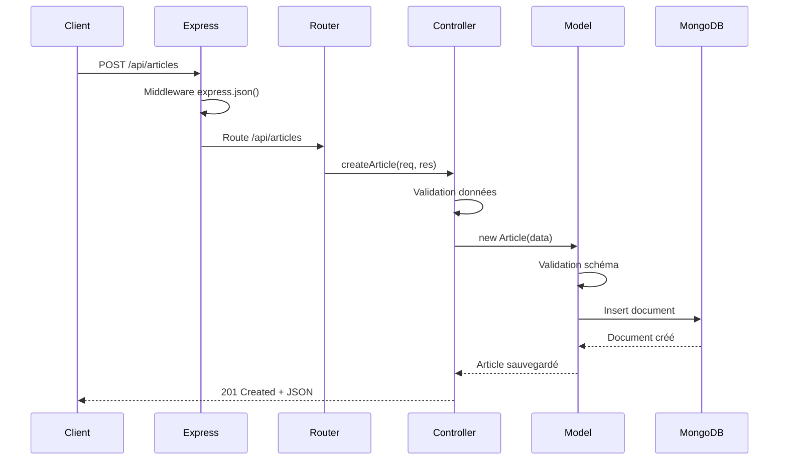
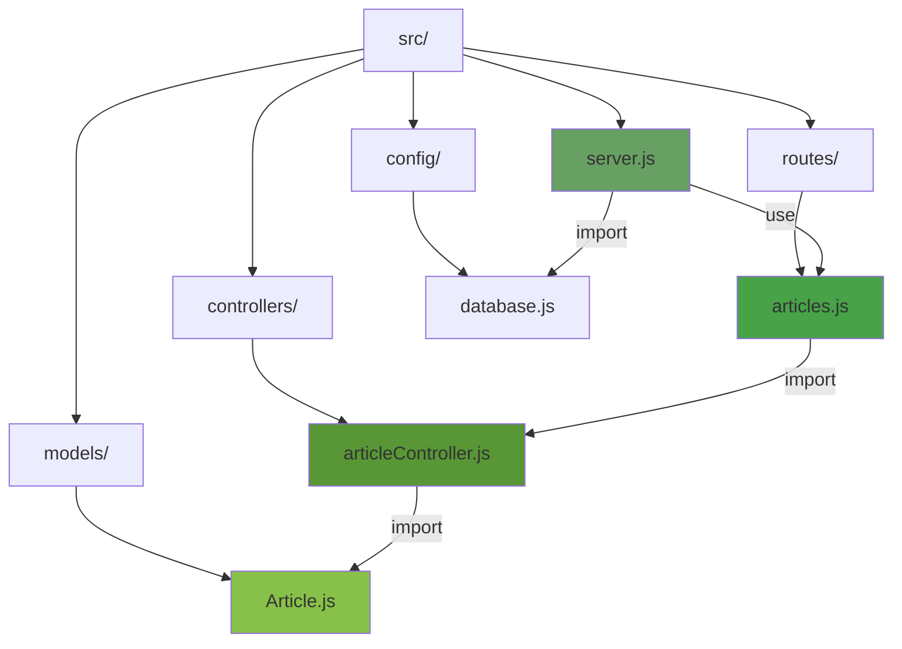
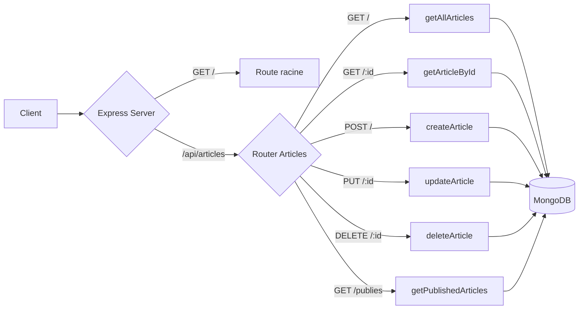

# Module 05 : Routes et Controllers - Articles

> **Tag Git** : `module-05`  
> **Commit** : `[MODULE-05] Architecture MVC - Routes et Controllers pour les articles`

---

## 🎯 Objectifs d'apprentissage

À la fin de ce module, vous serez capable de :

- [ ] Comprendre l'architecture MVC (Model-View-Controller)
- [ ] Créer des routes Express modulaires
- [ ] Implémenter des controllers avec logique métier
- [ ] Structurer une API REST conforme aux conventions
- [ ] Gérer les erreurs de manière appropriée
- [ ] Tester les endpoints avec des outils HTTP

## 📚 Prérequis

- Modules 01 à 04 complétés
- Compréhension des requêtes HTTP (GET, POST, PUT, DELETE)
- Connaissance de base des API REST
- Un outil de test d'API (Postman, Thunder Client, ou curl)

---

## 📖 Partie théorique (30-40%)

### Introduction

Dans le Module 04, nous avons créé notre modèle Article. Maintenant, nous allons **exposer ce modèle via une API REST** en utilisant l'architecture MVC. Cela permettra aux clients (navigateur, app mobile, etc.) d'interagir avec nos données.

**Qu'est-ce qu'une API REST ?**
REST (Representational State Transfer) est un style d'architecture pour les services web. Une API REST utilise les méthodes HTTP standard pour effectuer des opérations CRUD.

### Concepts clés

#### Concept 1 : Architecture MVC

**MVC** est un pattern d'architecture qui sépare l'application en trois composants :

```
┌─────────────────────────────────────┐
│         CLIENT (Browser)            │
└──────────────┬──────────────────────┘
               │ HTTP Request
               ▼
┌─────────────────────────────────────┐
│            ROUTES                   │
│  Définissent les URLs et méthodes   │
└──────────────┬──────────────────────┘
               │
               ▼
┌─────────────────────────────────────┐
│          CONTROLLER                 │
│    Logique métier et traitement     │
└──────────────┬──────────────────────┘
               │
               ▼
┌─────────────────────────────────────┐
│            MODEL                    │
│   Interaction avec la base de       │
│           données                   │
└──────────────┬──────────────────────┘
               │
               ▼
┌─────────────────────────────────────┐
│          MongoDB                    │
└─────────────────────────────────────┘
```

**Avantages du MVC :**
- **Séparation des responsabilités** : Chaque composant a un rôle précis
- **Maintenabilité** : Code organisé et facile à modifier
- **Testabilité** : Chaque couche peut être testée indépendamment
- **Réutilisabilité** : Les composants peuvent être réutilisés

**Vocabulaire technique :**
- **Model** : Gère les données et la logique de base de données
- **View** : Présentation (dans une API REST, c'est le JSON retourné)
- **Controller** : Logique métier, fait le lien entre Model et View
- **Route** : Définit les endpoints de l'API

#### Concept 2 : API REST et méthodes HTTP

**REST** utilise les méthodes HTTP pour effectuer des opérations :

| Méthode HTTP | Opération CRUD | Description | Exemple |
|--------------|----------------|-------------|---------|
| **GET** | Read | Lire des données | GET /api/articles |
| **POST** | Create | Créer une ressource | POST /api/articles |
| **PUT** | Update | Mettre à jour complet | PUT /api/articles/123 |
| **PATCH** | Update | Mise à jour partielle | PATCH /api/articles/123 |
| **DELETE** | Delete | Supprimer une ressource | DELETE /api/articles/123 |

**Conventions d'URL :**
```
GET    /api/articles       → Liste tous les articles
GET    /api/articles/:id   → Récupère un article spécifique
POST   /api/articles       → Crée un nouvel article
PUT    /api/articles/:id   → Modifie un article
DELETE /api/articles/:id   → Supprime un article
```

**Codes de statut HTTP :**
- **200 OK** : Succès
- **201 Created** : Ressource créée
- **400 Bad Request** : Erreur de validation
- **404 Not Found** : Ressource non trouvée
- **500 Internal Server Error** : Erreur serveur

#### Concept 3 : Router Express

Le **Router Express** permet de créer des routes modulaires.

**Sans router (tout dans server.js) :**
```javascript
app.get('/api/articles', (req, res) => { ... });
app.post('/api/articles', (req, res) => { ... });
app.get('/api/users', (req, res) => { ... });
// Fichier server.js devient énorme !
```

**Avec router (modulaire) :**
```javascript
// routes/articles.js
const router = express.Router();
router.get('/', getAllArticles);
router.post('/', createArticle);

// server.js
app.use('/api/articles', articleRoutes);
```

**Avantages :**
- Organisation du code
- Réutilisation
- Middleware spécifiques par route

#### Concept 4 : Middleware express.json()

**Middleware** = Fonction qui a accès à req, res, et next.

**express.json()** parse le corps des requêtes JSON :

```javascript
// Sans express.json()
app.post('/articles', (req, res) => {
    console.log(req.body);  // undefined ❌
});

// Avec express.json()
app.use(express.json());
app.post('/articles', (req, res) => {
    console.log(req.body);  // { titre: "...", ... } ✅
});
```

### Pourquoi cette approche ?

1. **MVC** : Structure claire et professionnelle
2. **Router modulaire** : Un fichier par ressource (articles, users, comments)
3. **Controllers** : Logique métier séparée des routes
4. **Gestion d'erreurs** : Feedback clair pour le client

---

## 📊 Schémas et visualisations

### Flux d'une requête HTTP



### Architecture du projet (structure MVC)



### Mapping des routes



---

## 💻 Partie pratique (60-70%)

### Étape 1 : Création de la structure

```bash
mkdir src/routes src/controllers
```

Structure finale :
```
src/
├── config/
│   └── database.js
├── models/
│   └── Article.js
├── routes/           ← Nouveau
│   └── articles.js
├── controllers/      ← Nouveau
│   └── articleController.js
└── server.js
```

### Étape 2 : Création du Controller

Le controller contient la logique métier.

**Fichier : `src/controllers/articleController.js`**

```javascript
const Article = require('../models/Article');

/**
 * CREATE - Créer un nouvel article
 */
const createArticle = async (req, res) => {
    try {
        const { titre, contenu, auteur, categorie } = req.body;

        const article = new Article({
            titre,
            contenu,
            auteur,
            categorie
        });

        const articleSauvegarde = await article.save();

        res.status(201).json({
            success: true,
            message: 'Article créé avec succès',
            data: articleSauvegarde
        });

    } catch (error) {
        if (error.name === 'ValidationError') {
            return res.status(400).json({
                success: false,
                message: 'Erreur de validation',
                errors: Object.values(error.errors).map(err => err.message)
            });
        }

        res.status(500).json({
            success: false,
            message: 'Erreur serveur',
            error: error.message
        });
    }
};

/**
 * READ ALL - Récupérer tous les articles
 */
const getAllArticles = async (req, res) => {
    try {
        const articles = await Article.find().sort({ createdAt: -1 });

        res.status(200).json({
            success: true,
            count: articles.length,
            data: articles
        });
    } catch (error) {
        res.status(500).json({
            success: false,
            message: 'Erreur lors de la récupération',
            error: error.message
        });
    }
};

/**
 * READ ONE - Récupérer un article par ID
 */
const getArticleById = async (req, res) => {
    try {
        const { id } = req.params;
        const article = await Article.findById(id);

        if (!article) {
            return res.status(404).json({
                success: false,
                message: 'Article non trouvé'
            });
        }

        await article.incrementerVues();

        res.status(200).json({
            success: true,
            data: article
        });
    } catch (error) {
        if (error.kind === 'ObjectId') {
            return res.status(400).json({
                success: false,
                message: 'ID invalide'
            });
        }

        res.status(500).json({
            success: false,
            message: 'Erreur serveur',
            error: error.message
        });
    }
};

/**
 * UPDATE - Mettre à jour un article
 */
const updateArticle = async (req, res) => {
    try {
        const { id } = req.params;

        const article = await Article.findByIdAndUpdate(
            id,
            req.body,
            {
                new: true,
                runValidators: true
            }
        );

        if (!article) {
            return res.status(404).json({
                success: false,
                message: 'Article non trouvé'
            });
        }

        res.status(200).json({
            success: true,
            message: 'Article mis à jour',
            data: article
        });
    } catch (error) {
        // Gestion d'erreurs...
    }
};

/**
 * DELETE - Supprimer un article
 */
const deleteArticle = async (req, res) => {
    try {
        const { id } = req.params;
        const article = await Article.findByIdAndDelete(id);

        if (!article) {
            return res.status(404).json({
                success: false,
                message: 'Article non trouvé'
            });
        }

        res.status(200).json({
            success: true,
            message: 'Article supprimé',
            data: article
        });
    } catch (error) {
        // Gestion d'erreurs...
    }
};

module.exports = {
    createArticle,
    getAllArticles,
    getArticleById,
    updateArticle,
    deleteArticle
};
```

**Points clés du controller :**

1. **Fonctions async/await** : Pour gérer les opérations asynchrones
2. **try/catch** : Capture toutes les erreurs
3. **Status codes appropriés** : 200, 201, 400, 404, 500
4. **Format de réponse cohérent** : `{ success, message, data }`
5. **Gestion des erreurs spécifiques** : ValidationError, ObjectId invalide

### Étape 3 : Création des Routes

**Fichier : `src/routes/articles.js`**

```javascript
const express = require('express');
const router = express.Router();

const {
    createArticle,
    getAllArticles,
    getArticleById,
    updateArticle,
    deleteArticle
} = require('../controllers/articleController');

// Routes CRUD
router.get('/', getAllArticles);           // Liste
router.post('/', createArticle);           // Création
router.get('/:id', getArticleById);        // Un article
router.put('/:id', updateArticle);         // Mise à jour
router.delete('/:id', deleteArticle);      // Suppression

module.exports = router;
```

**Explications :**

- `router.get('/', ...)` : Définit une route GET
- Le chemin `/` est relatif à `/api/articles` (défini dans server.js)
- Donc `router.get('/')` → `GET /api/articles`
- Et `router.get('/:id')` → `GET /api/articles/:id`

### Étape 4 : Modification du serveur

**Fichier : `src/server.js` (ajouts)**

```javascript
// ... imports existants

const app = express();

// ============================================
// MIDDLEWARES
// ============================================

// Parser JSON (OBLIGATOIRE pour POST/PUT)
app.use(express.json());

// Parser les données de formulaires
app.use(express.urlencoded({ extended: true }));

// ============================================
// ROUTES
// ============================================

// Route racine
app.get('/', (req, res) => {
    res.json({
        message: 'Bienvenue sur l\'API du Blog MERN !',
        version: '1.0.0',
        endpoints: {
            articles: '/api/articles'
        }
    });
});

// Montage des routes articles
const articleRoutes = require('./routes/articles');
app.use('/api/articles', articleRoutes);

// ... reste du code
```

**Points clés :**

1. **`app.use(express.json())`** : DOIT être avant les routes
2. **`app.use('/api/articles', articleRoutes)`** : Monte le router
3. Toutes les routes du router sont préfixées par `/api/articles`

### Étape 5 : Test de l'API

**Démarrer le serveur :**

```bash
# Démarrer MongoDB
docker-compose up -d

# Démarrer le serveur
npm run dev
```

**Test 1 : Lister tous les articles (vide au début)**

```bash
curl http://localhost:3000/api/articles
```

**Réponse attendue :**
```json
{
  "success": true,
  "count": 0,
  "data": []
}
```

**Test 2 : Créer un article**

```bash
curl -X POST http://localhost:3000/api/articles \
  -H "Content-Type: application/json" \
  -d '{
    "titre": "Mon premier article via API",
    "contenu": "Ceci est le contenu de mon premier article créé via l API REST.",
    "auteur": "Jean Dupont",
    "categorie": "Technologie"
  }'
```

**Réponse attendue :**
```json
{
  "success": true,
  "message": "Article créé avec succès",
  "data": {
    "_id": "6540...",
    "titre": "Mon premier article via API",
    "contenu": "Ceci est le contenu...",
    "auteur": "Jean Dupont",
    "categorie": "Technologie",
    "publie": false,
    "vues": 0,
    "createdAt": "2025-10-24T...",
    "updatedAt": "2025-10-24T..."
  }
}
```

**Test 3 : Récupérer un article par ID**

```bash
# Remplacez {ID} par l'ID de l'article créé
curl http://localhost:3000/api/articles/{ID}
```

**Test 4 : Mettre à jour un article**

```bash
curl -X PUT http://localhost:3000/api/articles/{ID} \
  -H "Content-Type: application/json" \
  -d '{
    "titre": "Titre modifié",
    "contenu": "Contenu modifié",
    "auteur": "Jean Dupont",
    "categorie": "Lifestyle"
  }'
```

**Test 5 : Supprimer un article**

```bash
curl -X DELETE http://localhost:3000/api/articles/{ID}
```

---

## 🎯 Points clés à retenir

### Résumé des concepts importants

1. **Architecture MVC** : Séparation Routes / Controllers / Models
2. **Router Express** : Modules routes pour organiser le code
3. **Controllers** : Fonctions async/await avec gestion d'erreurs
4. **API REST** : GET, POST, PUT, DELETE avec conventions d'URL
5. **express.json()** : Middleware indispensable pour parser JSON
6. **Status codes** : 200, 201, 400, 404, 500 selon le contexte

### Checklist de validation

- [ ] Les dossiers routes/ et controllers/ sont créés
- [ ] Le controller contient toutes les fonctions CRUD
- [ ] Les routes sont définies dans routes/articles.js
- [ ] express.json() est activé dans server.js
- [ ] Le serveur démarre sans erreur
- [ ] GET /api/articles retourne une liste vide
- [ ] POST /api/articles crée un article
- [ ] GET /api/articles/:id récupère un article
- [ ] PUT /api/articles/:id modifie un article
- [ ] DELETE /api/articles/:id supprime un article

---

## 📝 Référence Git

### Fichiers créés/modifiés

- `src/controllers/articleController.js` : ✨ Controller avec logique CRUD
- `src/routes/articles.js` : ✨ Routes modulaires pour articles
- `src/server.js` : ✏️ Ajout middlewares et montage des routes

---

## ➡️ Prochaine étape

**Module 06 : Opérations CRUD complètes** - Pagination, filtres, recherche

---

**Dernière mise à jour :** 24 octobre 2025  
**Module :** 05/15

